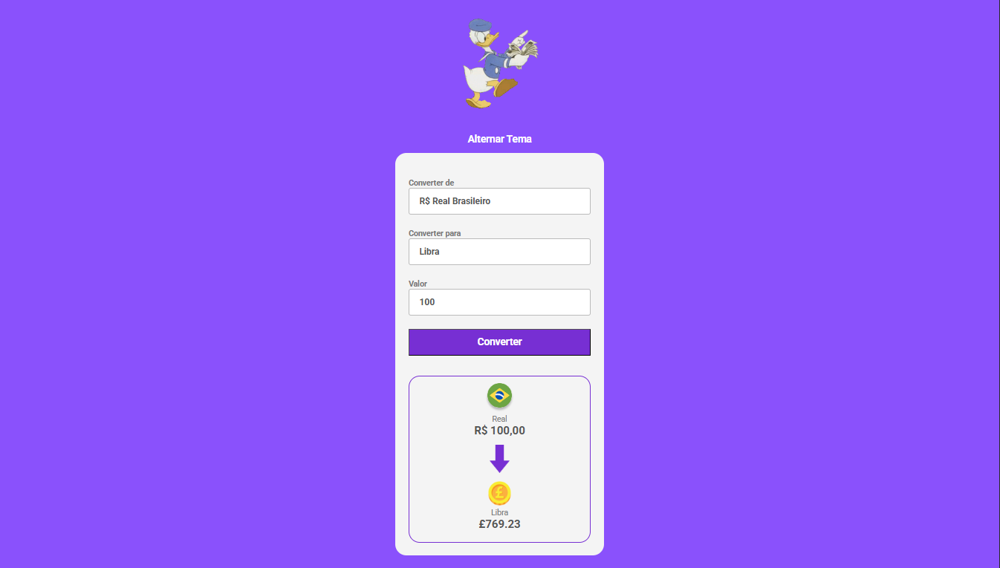
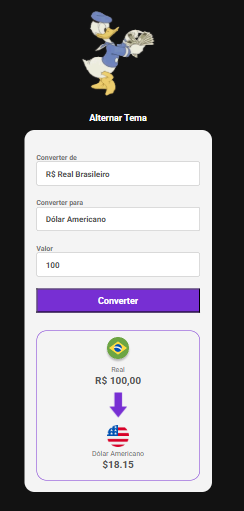
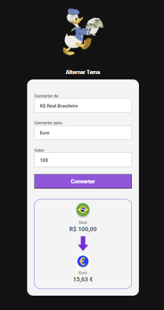

# Conversor de Moedas

O Conversor de Moedas é uma ferramenta digital que permite calcular rapidamente o valor de uma moeda em relação a outra, com base nas taxas de câmbio atuais. Seu principal objetivo é facilitar a conversão entre diferentes moedas estrangeiras de forma prática, rápida e precisa.

Com uma interface simples e intuitiva, o usuário pode selecionar a moeda de origem e a moeda de destino, inserir o valor desejado e obter instantaneamente o resultado convertido. O sistema pode utilizar taxas de câmbio atualizadas automaticamente, garantindo maior confiabilidade nos cálculos.
## 🛠 Habilidades

 

 

 
  
  
   

 

 

